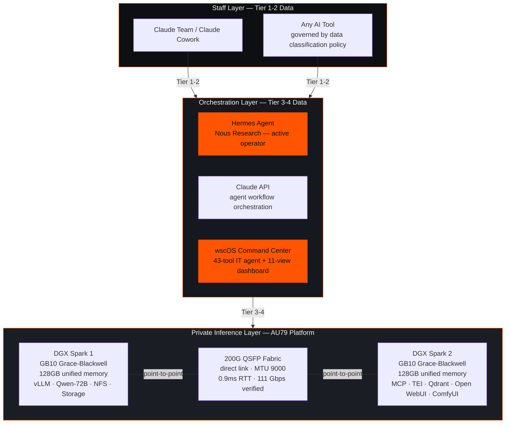
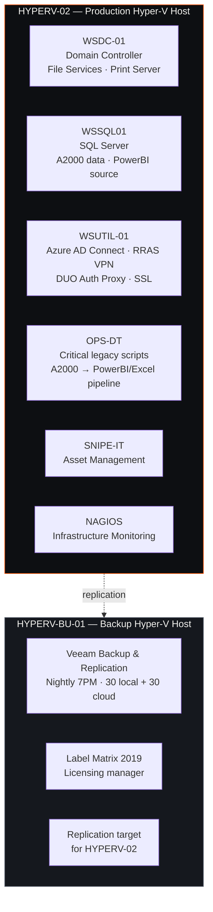
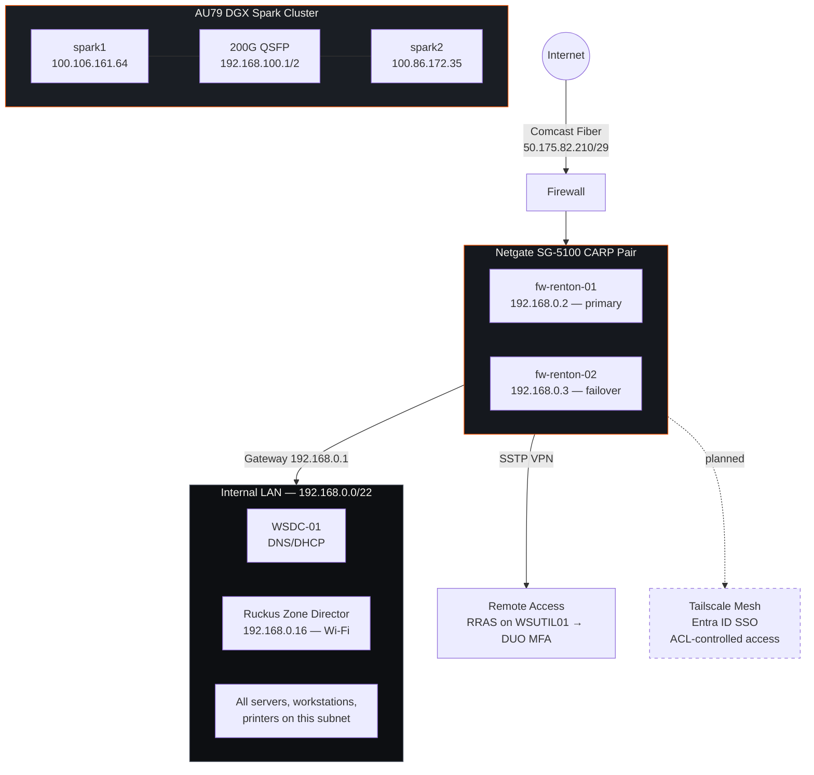
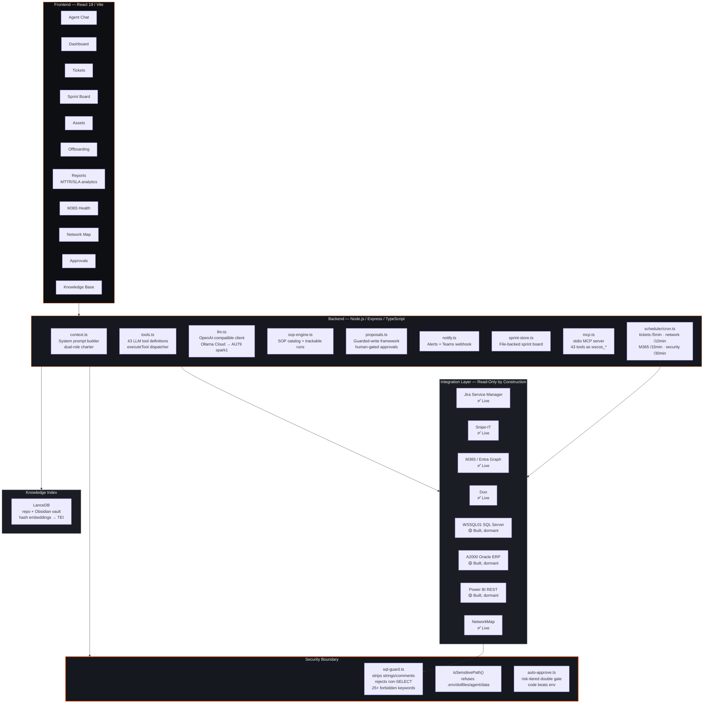
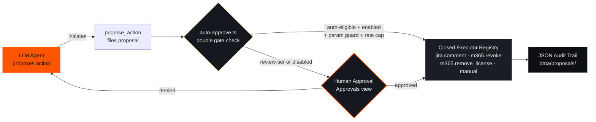
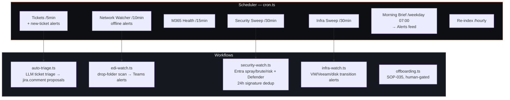
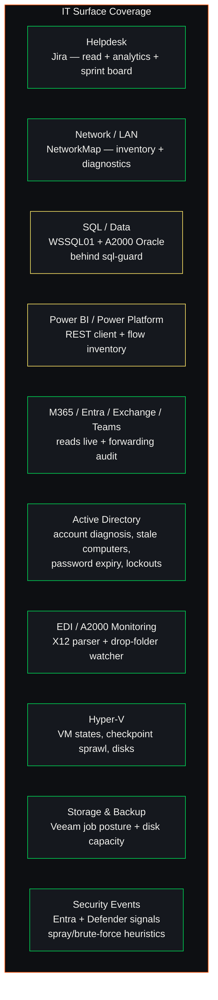
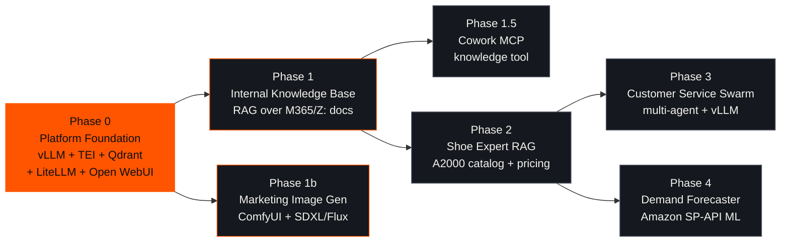

# wscOS Architecture Diagram

> Reference architecture for the Manteis Sovereign OS proof-of-deployment.
> Anonymized — no client identifiers. This is the public-facing architecture
> diagram for sales decks, case studies, and the Manteis Systems knowledge base.
>
> Source: wscOS architecture.md (internal), BRAND-GUIDELINES.md §Reference Architecture.
> Created: 2026-08-21 | Status: DRAFT — Rhett approves before public use.

---

## System Overview — Three-Layer Architecture

---

## Infrastructure Topology — Server & VM

---

## Network Topology

---

## Agent Architecture — wscOS Command Center

---

## Trust Model — Propose-to-Act Architecture

**Key principles:**
- **Read-only by construction** — every SQL path passes `guardReadOnlySql()`; client modules expose no mutation
- **Propose-to-act by design** — the agent initiates changes only via `propose_action` → Approvals view → closed executor registry
- **Code beats env** — production-touching kinds (m365.*, AD/EDI/network) are `review`-tier in code and can never be auto-approved via environment variables
- **Double gate for autopilot** — a proposal executes unattended only if the kind is `auto-eligible` in code AND enabled in `AUTO_APPROVE_KINDS` AND `AUTO_APPROVE_ENABLED` is on, plus param guard and rate cap
- **Full audit trail** — every executed proposal logged to `data/proposals/` with identity, timestamp, parameters

---

## Scheduled Operations — Cron Loops

---

## Domain Coverage — 43-Tool Full-Stack IT Agent

**Legend:** 🟢 Green border = Live · 🟡 Yellow border = Built, dormant (awaiting credentials/consent)

---

## AI Platform Build Order

**Status:** Hardware verified online (2026-05-14). Phase 0 software buildout gated on three dependencies: Entra admin consent for Graph API, Z: drive read-only service account, and data-classification sign-off.

---

## Key Metrics — What wscOS Proves

| Metric | Value |
|---|---|
| LLM tools | 43 |
| Dashboard views | 11 |
| Runnable skills | 26 |
| DGX Spark nodes | 2 (128GB unified memory each) |
| Fabric bandwidth | 200G QSFP (111 Gbps verified) |
| Live integrations | 5 (Jira, Snipe-IT, M365/Entra, Duo, NetworkMap) |
| Dormant integrations | 3 (WSSQL01, A2000 Oracle, Power BI — awaiting credentials) |
| Backup schedule | Nightly 7PM, 30 local + 30 cloud retention |
| Scheduled cron loops | 7 (tickets, network, M365, security, infra, morning brief, re-index) |
| Trust model | Read-only by construction, propose-to-act by design |
| Autopilot | Risk-tiered double gate, code beats env, ships off by default |

---

## What This Means for Manteis Systems Clients

When we deliver a Manteis One / Core / Fortress, we're delivering a configured version of a stack that is already running a real business. Not a demo. Not a pilot. Not a prototype. A production system with 43 tools, 11 dashboard views, 26 skills, and a proven governance model — running today, operating IT for a real manufacturer.

The wscOS reference architecture is the proof that sovereign AI works at enterprise scale.

---

*Diagram created 2026-08-21. Mermaid syntax — renders in GitHub, Obsidian, and any Mermaid-compatible viewer. Anonymized per Manteis Systems privacy policy.*